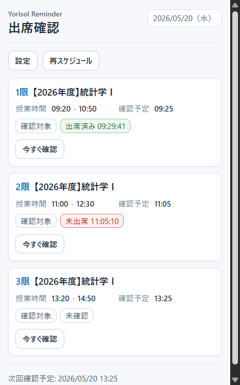
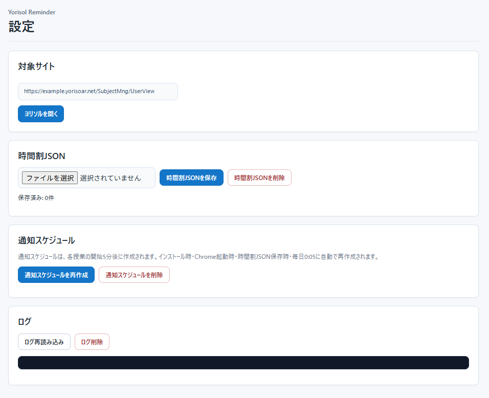
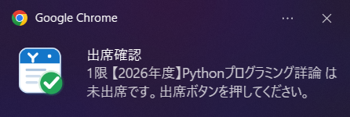

# Yorisol Attendance Reminder

ヨリソルの出席確認を補助する Chrome 拡張機能です。授業開始から5分後にヨリソルを確認し、まだ「出席する」ボタンが残っている場合だけ通知します。

この拡張機能は出席ボタンを自動で押しません。確認専用の非アクティブタブを開き、DOM上の「出席済み」「出席する」表示だけを確認します。

また、確認時刻になると、拡張機能がヨリソル確認用のタブを自動で開きます。このタブは出席状態を確認するために必要なので、確認が終わって自動で閉じるまでは手動で閉じないでください。確認途中で閉じた場合は、5分後に1回だけ自動再確認します。ログイン切れの場合はタブを閉じずに残し、通知をクリックするとそのタブを前面に出せます。

## 対応ブラウザ

この拡張機能は Google Chrome での利用を主な対象としています。

Brave や Microsoft Edge などの Chromium 系デスクトップブラウザでも利用できる可能性がありますが、ブラウザごとの差異により挙動が異なる場合があります。

Firefox、Safari、モバイル版ブラウザは対象外です。

## スクリーンショット

### Popup



popupでは、今日の日付、今日の授業一覧、授業時間、確認予定時刻、確認対象かどうか、直近の確認結果、次回確認予定を確認できます。次回確認予定が自動再確認の場合は `（再確認）` と表示します。手動で「今すぐ確認」も実行できます。

### 設定画面



設定画面では、対象サイトの確認、時間割JSONの保存・削除、通知スケジュールの再作成・削除、ログの確認・削除ができます。

### 通知



確認時に出席ボタンがまだ押されていない状態だと判定された場合は、ブラウザの通知で対象の時限・授業名を表示します。通知をクリックすると、対象授業のモーダルを開き、対象日付の `targetKoma` 番目の授業ページ内にある出席ボタン位置まで移動します。

## 事前準備

以下をインストールしておいてください。

- Git
- Node.js

## 初期セットアップ

任意の作業用ディレクトリに移動して、このリポジトリを clone します。

### macOS / Linux / Git Bash の場合

以下では `~/dev` に保存する例を示します。

```bash
mkdir -p ~/dev
cd ~/dev
git clone https://github.com/usxc/yorisol-attendance-reminder.git
cd yorisol-attendance-reminder
```

ローカル設定ファイルを生成します。

```bash
node scripts/setup-local.mjs
```

### Windows PowerShell の場合

以下では、ユーザーフォルダ直下の `dev` に保存する例を示します。

```powershell
New-Item -ItemType Directory -Force "$HOME\dev" | Out-Null
Set-Location "$HOME\dev"
git clone https://github.com/usxc/yorisol-attendance-reminder.git
Set-Location .\yorisol-attendance-reminder
```

ローカル設定ファイルを生成します。

```powershell
node .\scripts\setup-local.mjs
```

実行すると、ヨリソルURLのサブドメイン部分の入力を求められます。

たとえばヨリソルURLが `https://example.yorisoar.net/...` の場合は、`example` だけを入力します。

以下のように入力すると、`manifest.json` と `config/config.local.js` が生成されます。

```text
Yorisoar subdomain: example
Generated: manifest.json
Generated: config/config.local.js

ローカル設定ファイルを生成しました。
manifest.json と config/config.local.js はGitにコミットしないでください。
```

生成される `manifest.json` と `config/config.local.js` はGit管理対象外です。

## ブラウザへの読み込み

### Google Chrome の場合

1. `chrome://extensions` を開く
2. デベロッパーモードをON
3. 「パッケージ化されていない拡張機能を読み込む」を選択
4. このリポジトリのフォルダを選択

### Brave の場合

1. `brave://extensions` を開く
2. デベロッパーモードをON
3. 「Load unpacked」または「パッケージ化されていない拡張機能を読み込む」を選択
4. このリポジトリのフォルダを選択

### Microsoft Edge の場合

1. `edge://extensions` を開く
2. デベロッパーモードをON
3. 「展開して読み込み」または「Load unpacked」を選択
4. このリポジトリのフォルダを選択

## 時間割JSONの読み込み

拡張機能の設定画面を開き、`sample/timetable.sample.json` を参考に作成した時間割JSONを読み込んでください。

時間割JSONを保存すると、通知スケジュールも自動で再作成されます。

## 設定画面

設定画面では以下を操作できます。

- 対象サイトを開く
- 時間割JSONを保存
- 保存済み時間割JSONを削除
- 通知スケジュールを再作成
- 通知スケジュールを削除
- ログを再読み込み
- ログを削除

時間割JSONを保存すると、通知スケジュールも自動で再作成されます。

## 時間割JSON

拡張が読み込む主データは時間割JSONだけです。授業名対応表JSONは読み込みません。

```json
[
  {
    "date": "2026-04-13",
    "weekday": "月",
    "period": 1,
    "start": "09:20",
    "end": "10:50",
    "subject": "サンプル授業A",
    "kind": "class",
    "attendance_enabled": true,
    "yorisol_subject": "【2026年度】サンプル授業A",
    "yorisol_search_subject": "【2026年度】サンプル授業A"
  }
]
```

`attendance_enabled: true` の授業だけが通知対象です。

`yorisol_subject` はpopupなどの表示に使います。

`yorisol_search_subject` はヨリソルDOM内で授業を探す検索キーと、同日同一授業の `targetKoma` 計算に使います。現在の運用では、上の例のように2つを同じ値にして問題ありません。

## 通知スケジュール

通知確認は、授業開始から5分後に実行します。初回確認で出席ボタンが見つからない場合、対象日付の授業nodeがまだ見つからない場合、または確認用タブが途中で閉じられた場合は、授業終了前であれば5分後に1回だけ自動再確認します。

例:

- `09:20` 開始 → `09:25` 確認
- `11:00` 開始 → `11:05` 確認

スケジュールは、少なくとも今日と明日の分だけ登録します。全年度分を一括でalarm登録しません。

通知スケジュールは以下のタイミングで自動再作成されます。

- 拡張機能インストール時
- ブラウザ起動時
- 時間割JSON保存時
- 毎日 `0:05`

alarm名は対象スロットを復元できる形式です。

```text
attendance:2026-04-13:1
```

## 出席確認の流れ

1. 授業開始5分後にalarmが発火
2. 確認専用の非アクティブタブで対象URLを開く
3. 対象授業を探す
4. 授業詳細を開く
5. 授業タブを開く
6. 対象日付のnodeを探す
7. `targetKoma` 番目のnodeを開く
8. 「出席済み」表示があるか確認
9. 「出席する」ボタンがあるか確認
10. 必要な場合だけ通知
11. 必要に応じて5分後の自動再確認を1回だけ予約
12. 確認完了後、確認専用タブを閉じる

ログイン切れでSSO画面に飛ばされた場合は、確認専用タブを閉じずに残します。通知をクリックすると、そのタブを前面に出せます。

## ログ

ログは `chrome.storage.local` に保存します。最大件数は100件です。

主に以下を記録します。

- 時間割JSON保存
- 通知スケジュール再作成
- alarm登録数
- alarm発火
- 自動再確認の予約
- 対象授業
- `targetKoma`
- 出席確認結果
- ログイン必要
- エラー

## サンプル

公開用の架空データは [sample/timetable.sample.json](sample/timetable.sample.json) にあります。実運用では、ローカルの実データを読み込んでください。
